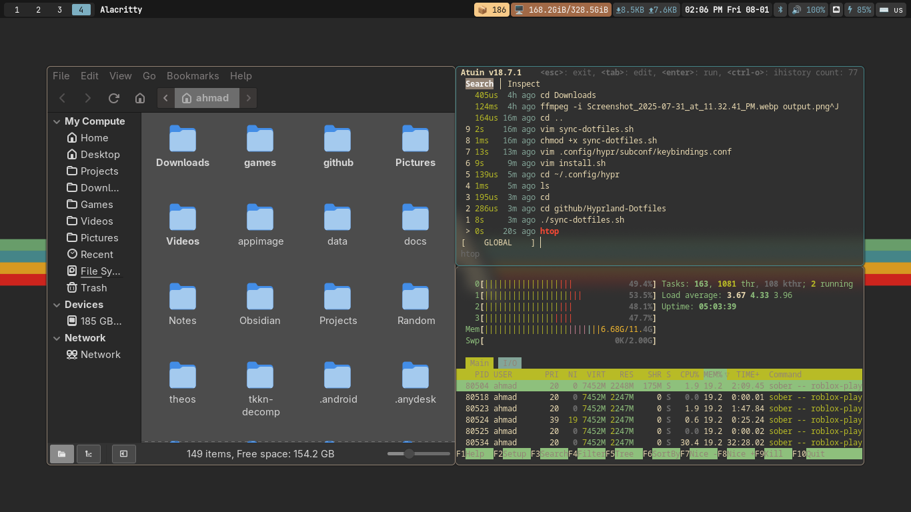
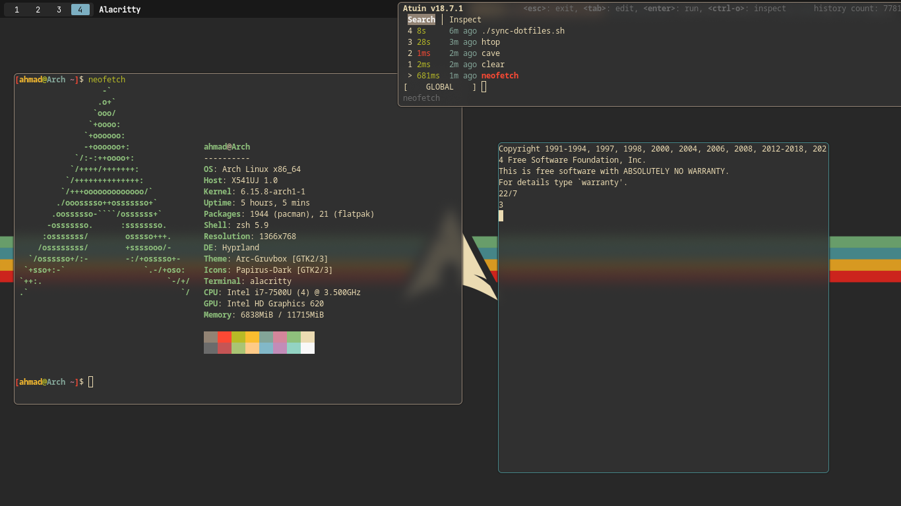
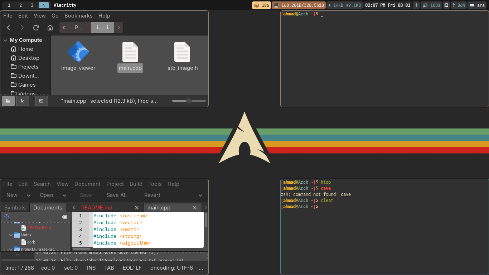

  

<h1 align="center">✨ My Hyprland Dotfiles ✨</h1>

---

## 🔍 Preview

  
  
  

---

## ⌨️ Keybindings

### 💻 Applications
| Keybind                 | Action                          |
|------------------------|----------------------------------|
| `$mainMod + Return`    | Launch terminal (`alacritty`)    |
| `$mainMod + D`         | Run launcher (`rofi`)            |
| `$mainMod + W`         | Launch browser (`zen-browser`)   |
| `$mainMod + E`         | Launch file manager (`nemo`)     |
| `$mainMod + Shift + E` | Launch file manager as root      |
| `$mainMod + N`         | Launch Obsidian                  |
| `$mainMod + Shift + R` | Launch htop                      |

### 🔄 System
| Keybind                     | Action              |
|----------------------------|---------------------|
| `$mainMod + Shift + Q`     | Logout              |
| `$mainMod + Backspace`     | Logout              |
| `$mainMod + Ctrl + R`      | Reload Hyprland     |
| `$mainMod + M`             | Exit session        |

### 🧱 Window Management
| Keybind                  | Action               |
|-------------------------|----------------------|
| `$mainMod + Q`          | Kill active window   |
| `$mainMod + Shift + Space` | Toggle floating  |
| `$mainMod + F`          | Fullscreen           |
| `$mainMod + S`          | Pin window           |

Directional movement is available using arrows or `HJKL`.

### Workspaces
- Switch: `$mainMod + [1-9,0]`
- Move window: `$mainMod + Shift + [1-9,0]`
- Scroll through: `$mainMod + mouse/keys`

### 🖥️ Monitors
- Focus: `$mainMod + Left/Right`
- Move window: `$mainMod + Shift + Left/Right`

### 🪄 Scratchpads
| Name     | Keybind                      |
|----------|------------------------------|
| Terminal | `$mainMod + Shift + Return`  |
| Calculator | `$mainMod + '`             |
| Audio    | `$mainMod + F4`              |
| Network  | `$mainMod + Shift + W`       |
| Bmon     | `$mainMod + F5`              |

### 📸 Screenshots
- `Print` = Fullscreen via `grim`
- `Shift + Print` = Region via `slurp + grim`

### 🔊 Media & Audio
- `XF86*` keys and `$mainMod` combos for volume, brightness, playback, mute, etc.

---

## 📦 Dependencies

Make sure the following packages are installed: (or you can change them in the config)

- **Window Manager**
  - `hyprland`
- **Terminal**
  - `alacritty`
- **Launcher**
  - `rofi`
- **File Manager**
  - `nemo`
- **Browser**
  - `zen-browser` (or whatever you browser you want)
- **Text Editor**
  - `obsidian`
- **Audio**
  - `wpctl` (from `wireplumber`)
  - `playerctl`
- **Screenshot Tools**
  - `grim`
  - `slurp`
- **Clipboard**
  - `wl-clipboard`
  - `cliphist`
- **System Tools**
  - `wlogout`
  - `htop`
  - `brightnessctl`
  - `bmon`
- **Scripts**
  - `~/.config/hypr/scripts/gaps_control.sh`

---
